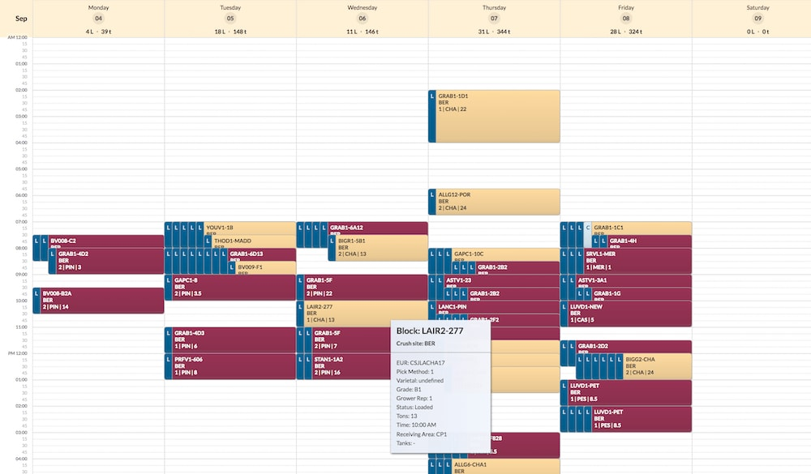
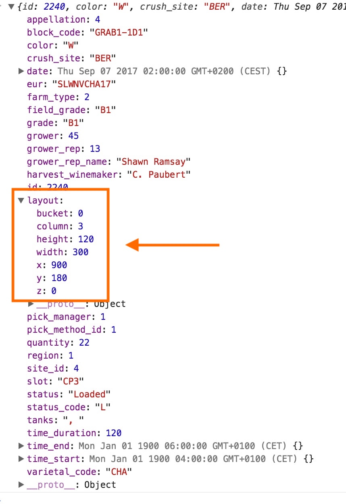
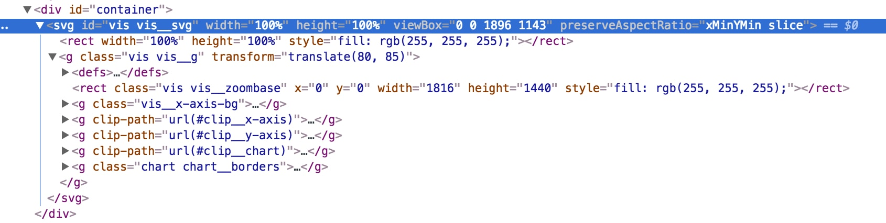
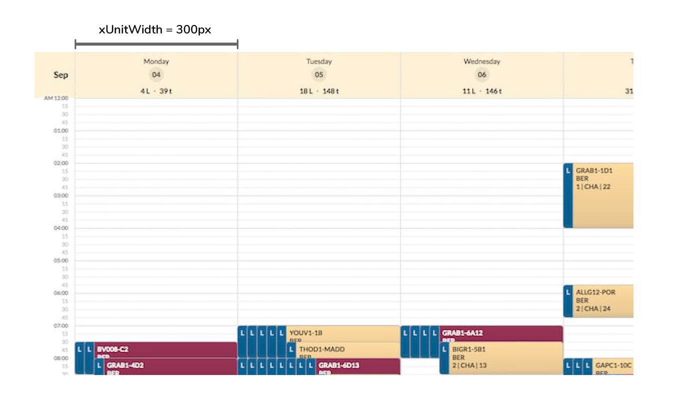
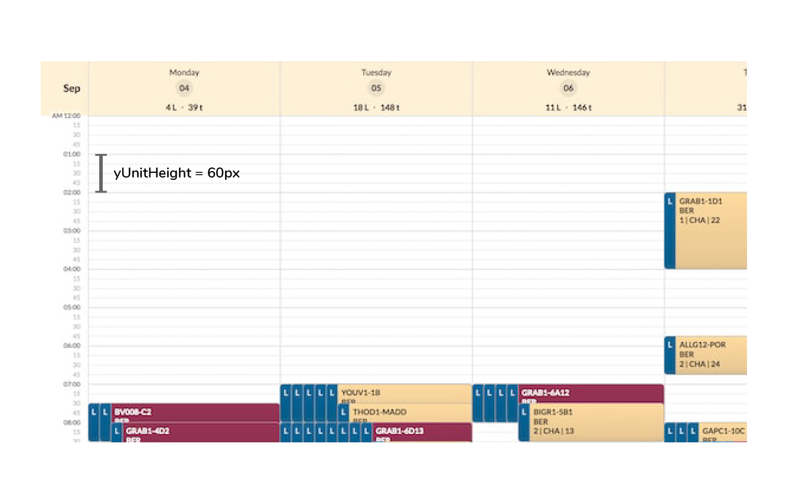
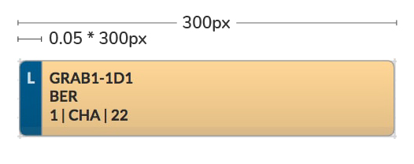
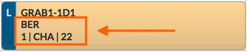
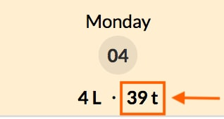
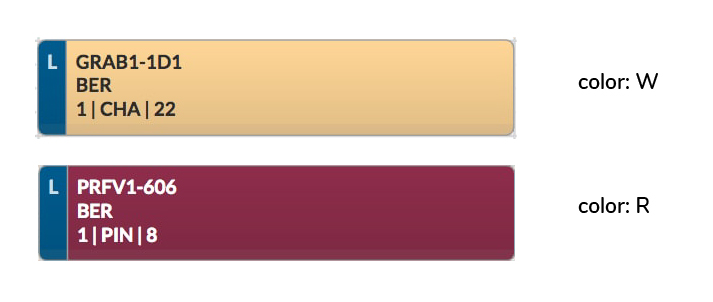

# ZAM-calendar

The ZAM-Calendar is a plugin to show events across time. A _vinoez_ example:



Rather a classic calendar layout. Each _event_ is shown as an _event card_. In above implementation (used in _vinoez_'s _Harvest Summary Calendar_) events are individual loads, scheduled across date (_x axis_) and time (_y axis_). Other _x_ dimensions can be implemented. Each event has a **main part** (red or beige) showing additional info and color encoding the grape type (_R_, _W_) and a **side part** (shades of blue) visualizing the status of the load: _**C**onfirmed_ → _**B**locked_ → _**L**oaded_. The _x axis_ holds additional information on the number of loads and the tons per _x_ unit (day in above example).

### Overlap

The layout arranges the cards so that at least the side part of each card is shown when times overlap within a day. Cards overlap in buckets with increasingly indented cards until a newly added card's start time is equal or greater to the end time of this bucket's first card.

### Interaction

* Zoom/Pan
* Card drag
* Card resize (bottom resize only)
* Hover over card shows tooltip with additional info

Zoom, pan, drag and resize are implemented in the plugin, hover interaction can be implemented application side.

## Installing

The recommended way is to install the latest release with `npm` via `git+ssh`.

Direct install:
 
```
npm install git+ssh://git@github.com/zamapps/zam-d3-calendar.git#v1.0.0

```

Indirect `package.json` install:

```
  "dependencies": {
    "zam-calendar": "git+ssh://git@github.com/zamapps/zam-d3-calendar.git#v1.0.0"
  }
```
Then run the following from your (e.g.) `vinoez` directory:

```
npm install zam-calendar
```
Whichever install method you use you might have to build it into your workflow. In ZAM apps you would also need to do:

```
grunt concat
```
## Minimal example

The workflow is:

1. Load data.
2. Create and configure a calendar instance.
3. Calculate a calendar layout.
4. Build the calendar by mounting it to a DOM element.


In code:

```

  // 1 Load and prep your data (not shown).
  const data = loadAndPrepData(rawData);
  
  // 2. Create and configure a calendar instance.
  const calendarInstance = zamCalendar.calendar() 

     // General and Dimensions:
    .parent('#container')
    .margin(margin)
    .xUnitWidth(300)
    .yUnitHeight(60)
    .indent(0.06)
    .ySnapStep(15)

     // Properties:
    .xTimeProp('date')
    .xPointProp('slot')
    .yStartProp('time_start')
    .yEndProp('time_end')
    .yDurationProp('time_duration')
    .eventStatusProp('status_code')
    .eventTypeProp('color')
    .eventTitleProp('block_code')
    .eventSubtitleProps(eventSubtitle)
    .quantityProp('quantity')
    .eventMainColorMap(typeColorMap)
    .eventSideColorMap(statusColorMap)

     // Other:	
    .tooltip('#calendar-tip')
    .dispatcher(dispatch);

  // 3. Calculate a calendar data layout.
  const layoutData = calendarInstance.layout(data, 'date');

  // 4. Build the calendar
  calendarInstance('#container', layoutData);


```
<sub>_No reason to pass out due to the quantity of configurations. Just copy this whole thing into your app and adapt them with the help of below API reference._</sub>

## Data Requirements for Layout Function

 * Data structure: Array of objects.

 * Required object properties and types:
     
    * _date_ property as JS date object
    * _time start_ property as JS date object
    * _time end_ property as JS date object
    * _time duration_ property in minutes as number
    * _slot_ property as string
    * _id_ property as a number
    
    Further properties as defined in [Data Properties](#data-properties) below.
    

## API Reference

The plugin code exposes the `zamCalendar` object, you can use to produce calendar instances with.

<a name="zamCalendar" href="#zamCalendar">#</a> zamCalendar.**calendar**()

Returns a calendar generator called _calendar_ in the following. The _calendar_ can be [configured](#configuration) using a chained syntax. Once configured you first augment your data with a layout function and then build the calendar with the main build function.

## Functions

Each calendar instance exposes two functions:

1. The **data layout function** that takes raw data and produces a pixel position layout.
2. The **calendar build function** that takes in the layout data to produce the calendar.

<a name="cal-layout" href="#cal-layout">#</a> _calender_**.layout**(⟨ _data_,  _view property_ ⟩) 

⟨ _data_ ⟩ is an array of objects, each representing a calendar event to display. 

⟨ _view property_ ⟩ defines what type of _x axis_ will be produced, a _continuous date axis_ or a _discrete axis_. As of now, _view property_ can either be `'slot'` or `'date'`. The chosen _view property_ also needs to be defined in [xPointProp](#cal-xPointProp) or [xTimeProp](#cal-xTimeProp), which determines the variable driving the _x axis_. This set-up allows toggling between two different _x axes_.

This _layout_ function returns the original data, augmented with a layout object holding all necessary information to position the event within the bounds of the chart:




<a name="cal-main-fn" href="#cal-main-fn">#</a> _calender_(⟨ _layout data_ ⟩)

⟨ _layout data_ ⟩ is an array of objects as returned by the [_calender_**.layout**()](#cal-layout) function. 

`calender()` builds an SVG rendered calendar as a child to the specified `parent` element:




## Configuration

Before running above functions the calendar instance needs to be configured with the following values. 

### General and Dimensions

<a name="cal-parent" href="#cal-parent">#</a> _calender_**.parent**(⟨ _string_ ⟩)

Required. ⟨ _string_ ⟩ must be set as the **class** or, preferably, the **id** name of the element the calendar-chart should be mounted on. 

<a name="cal-margin" href="#cal-margin">#</a> _calendar_**.margin**(⟨ _object_ ⟩)

Optional. ⟨ _object_ ⟩ can be set as a margin object defining _top_, _bottom_, _right_ and _left_ margins. If unspecified it defaults to:

```js
{ top: 85, right: 0, bottom: 0, left: 80 }
```

The extended _left_ and _top margin_ is necessary for the two axes to be shown. 

<a name="cal-xUnitWidth" href="#cal-xUnitWidth">#</a> _calendar_**.xUnitWidth**(⟨ _number_ ⟩)

Required. ⟨ _number_ ⟩ specifies the width of the _x axis_ unit in pixel. Above example has _day_ as the _x_ unit and an _xUnitWidth_ of 300 set with:

```
calendar.xUnitWidth(300) 
```



As a result each _x axis_ tick will be _300px_ wide.

<a name="cal-yUnitHeight" href="#cal-yUnitHeight">#</a> _calendar_**.yUnitHeight**(⟨ _number_ ⟩)

Required. ⟨ _number_ ⟩ specifies the height of the _y axis_ unit in pixel. For example above example has _hour_ as the _y_ unit and an _yUnitHeight_ of 60. As a result each major _y axis_ tick will be _60px_ wide.



<a name="cal-indent" href="#cal-indent">#</a> _calendar_**.indent**(⟨ _number_ ⟩)

Required. ⟨ _number_ ⟩ specifies how much space of the total _x unit width_ the side card gets allocated. Effectively, it defines the width of the side bar. 



It is calculated as _indent * xUnitWidth_ and as such is measured as a fraction of the _xUnitWidth_.

<a name="cal-ySnapStep" href="#cal-ySnapStep">#</a> _calendar_**.ySnapStep**(⟨ _number_ ⟩)

Optional. ⟨ _number_ ⟩ specifies the resolution in minutes, the user can move the event cards in y direction. In other words, it defines at which minute step the event cards will "snap" into position. Defaults to _15_.

### Data Properties

<a name="cal-xTimeProp" href="#cal-xTimeProp">#</a> _calendar_**.xTimeProp**(⟨ _string_ ⟩)

Required. ⟨ _string_ ⟩ specifies the property name of the date property in the original data that defines the date _x axis_ value. An example would be:

```
calendar.xTimeProp('date')
```

The implementation allows alternating between one time and one discrete variable to be represented on the _x axis_. Read on for the discrete property:

<a name="cal-xPointProp" href="#cal-xPointProp">#</a>_calendar_**.xPointProp**(⟨ _string_ ⟩)

Required. ⟨ _string_ ⟩ specifies the property name of the discrete property in the original data that defines the discrete _x axis_ value. 

<a name="cal-yStartProp" href="#cal-yStartProp">#</a> _calendar_**.yStartProp**(⟨ _string_ ⟩)

Required. ⟨ _string_ ⟩ specifies the name of the property that defines the start time of each event card in the original data. All event cards _y start position_ will be based on the given data property. An example would be 

```
calendar.yStartProp('time_start')
```

<a name="cal-yEndProp" href="#cal-yEndProp">#</a> _calendar_**.yEndProp**(⟨ _string_ ⟩)

Required. ⟨ _string_ ⟩ specifies the name of the property that defines the end time of each event card in the original data. All event cards _y end position_ will be based on the given data property. The duration will be calculated by this _end_ and the previous _start time_ property. 

<a name="cal-yDurationProp" href="#cal-yDurationProp">#</a>_calendar_**.yDurationProp**(⟨ _string_ ⟩)

Required. ⟨ _string_ ⟩ specifies the name of the property that defines the duration of each event card in the original data in minutes. In fact, this configuration has no effect on the actual calendar production but is required to change on data update (drag and resize).

<a name="cal-eventTypeProp" href="#cal-eventTypeProp">#</a> _calendar_**.eventTypeProp**(⟨ _string_ ⟩)

Required. ⟨ _string_ ⟩ specifies the name of the property that defines the color encoding of the main card in the original data. 

<a name="cal-eventStatusProp" href="#cal-eventStatusProp">#</a> _calendar_**.eventStatusProp**(⟨ _string_ ⟩)

Required. ⟨ _string_ ⟩ specifies the name of the property that defines the color encoding and labelling of the side card in the original data. 

<a name="cal-eventTitleProp" href="#cal-eventTitleProp">#</a> _calendar_**.eventTitleProp**(⟨ _string_ ⟩)

Required. ⟨ _string_ ⟩ specifies the name of the property that will be used as the main title of the the main card in the original data.

<a name="cal-eventSubtitleProps" href="#cal-eventSubtitleProps">#</a> _calendar_**.eventSubtitleProps**(⟨ _Array_ ⟩)

Required. ⟨ _Array_ ⟩ is an array of objects specifying which properties of the original data should be displayed as subtitle information on the main event card.



The ⟨ _Array_ ⟩ objects need to specify the _variable name_, the _display name_ and the _level_ (_level 1_ for the first row and _level 2_ for the second row of the subtitle). An example of an _eventSubtitle_ array producing above event card would look like so:

```
  const eventSubtitle = [
    {variable: 'crush_site', name: 'Crush site', level: 1},
    {variable: 'pick_method_id', name: 'Pick method', level: 2},
    {variable: 'varietal_code', name: 'Varietal', level: 2},
    {variable: 'quantity', name: 'Tons', level: 2}
  ]
```

<a name="cal-quantityProp" href="#cal-quantityProp">#</a> _calendar_**.quantityProp**(⟨ _string_ ⟩)

Required. ⟨ _string_ ⟩ specifies the name of the property that will be displayed as additional information per _x unit_ on the _x axis_. 



The property values need to be numeric.

<a name="cal-eventMainColorMap" href="#cal-eventMainColorMap">#</a> _calendar_**.eventMainColorMap**(⟨ _Map_ ⟩)

Required. ⟨ _Map_ ⟩ specifies the background and the text colors to be used for the main card events. Allocates the respective colors based on the [_eventTypeProp_](#cal-eventTypeProp). An example:


```
  const typeColorMap = new Map();
  typeColorMap.set('R', { back: '#993355', text: '#fff' });
  typeColorMap.set('W', { back: '#ffdba0', text: '#333' });

  calendar
    .eventTypeProp('color')
    .eventMainColorMap(typeColorMap)
    // (...)
```

Assuming 'color' has two categories: 'R' and 'W', the background and text colours will now be respectively defined by the _typeColorMap_.




<a name="cal-eventSideColorMap" href="#cal-eventSideColorMap">#</a> _calendar_**.eventSideColorMap**(⟨ _Map_ ⟩)

Required. ⟨ _Map_ ⟩ specifies the background and the text colors to be used for the side card events. Allocates the respective colors based on the [_eventStatusProp_](#cal-eventStatusProp). An example:


```
  const statusColorMap = new Map();
  statusColorMap.set('C', { back: '#ddf1fc', text: '#006699' });
  statusColorMap.set('B', { back: '#55bbee', text: '#fff' });
  statusColorMap.set('L', { back: '#006699', text: 'rgba(255,255,255,0.8)' });

  calendar
    .eventStatusProp('status_code')
    .eventSideColorMap(statusColorMap)
    // (...)
```

Assuming 'status_code' has three categories: 'C', 'B' and 'L', the background and text colours will now be respectively defined by the _statusColorMap_.

### Other configurations

<a name="cal-tooltip" href="#cal-tooltip">#</a> _calendar_**.tooltip**(⟨ _string_ ⟩)

Required. ⟨ _string_ ⟩ specifies the **class** or, preferably, the **id** name of the calendar tooltip element. The tooltip is being built in the application code, but will be toggled in the calendar plugin in some cases (during resize, drag).


<a name="cal-dispatcher" href="#cal-dispatcher">#</a> _calendar_**.dispatcher**(⟨ _d3.dispatch_ ⟩)

Optional. ⟨ _d3.dispatch_ ⟩ enables the calendar and the calling application code to be loosely coupled. The _dispatch_ is used to trigger data update events from the calendar which are handled in the application code. If inclined, see the [D3 documentation of _dispatch_](https://github.com/d3/d3-dispatch) for more details.


-------

If any problems ~~check [Stack Overflow](https://stackoverflow.com/search?q=zam-calendar) for _zam-calendar_,~~ file an issue at <https://github.com/zamapps/zam-d3-calendar/issues> or reach me at <lars@datamake.io>.

